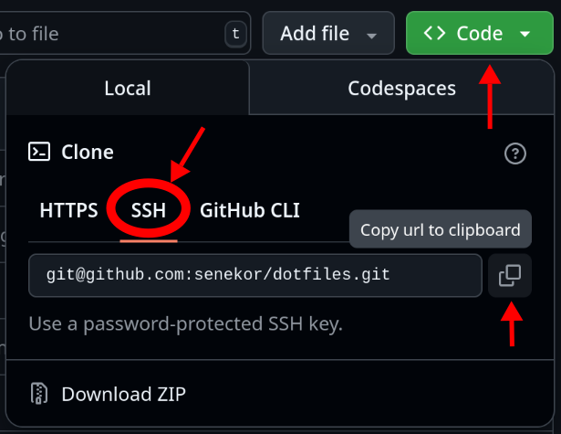

# Using GitHub (optional)

As promised, here are a few tips about using [GitHub](https://github.com/).
If you are not interested in this, feel free to skip to the next chapter, it won't become relevant later.

I want to mention that GitHub is not the only provider of Git-hosting services, but certainly the most popular one.
Others include [GitLab](https://about.gitlab.com/) and [Codeberg](https://codeberg.org/).
Codeberg is a free instance of [Forgejo](https://forgejo.org/), which is open-source software you can host yourself.

All of these providers work very similarly to what I'm describing below, so you should have no trouble adapting to other providers.

## Authenticating with an SSH key

Jujutsu needs to authenticate as your GitHub user in order to send and receive commits on your behalf.
It's possible to do that with username and password, but it's very tedious and I don't recommend it at all.
If making backup is tedious, you will do it **less often**.
Fewer backups means more risk of losing your work!
So let's make the authentication as seamless as possible.

The best authentication method is to use an SSH key.
It's more convenient and safer than a password.
GitHub has great documentation about how to set that up, so please follow the instructions here:
- [Generating a new SSH key](https://docs.github.com/en/authentication/connecting-to-github-with-ssh/generating-a-new-ssh-key-and-adding-it-to-the-ssh-agent)
- [Adding an SSH key to your account](https://docs.github.com/en/authentication/connecting-to-github-with-ssh/adding-a-new-ssh-key-to-your-github-account)

You can verify the setup with the following command:

```sh
ssh -T git@github.com
```

The expected output is:

```
Hi user! You've successfully authenticated, but GitHub does not provide shell access.
```

## Creating a new repository on GitHub

Skip ahead if you intend to use an already existing repo.

To create a new repository on GitHub, [click here](https://github.com/new) and fill out the form.
All you need to do is choose an owner (probably your username) and a repo name.
Also check that the visibility matches what you want (can be changed later).

If you already have a local repository with content that you want to push to this new remote, make sure to **not initialize the repo with any content**.
That means, no template, no README, no `.gitignore` and no license.

Finally, click on "Create repository".

## Cloning an existing repo

Navigate to the page of the existing repo in the browser.
Cick on the green button that says "Code".
**Select SSH** in the drop-down (assuming you have set up an SSH key as explained above).
Copy the URL that's displayed.



Finally, paste the URL into Jujutsu's clone command:

```sh
jj git clone --colocate <COPIED_URL>
```
