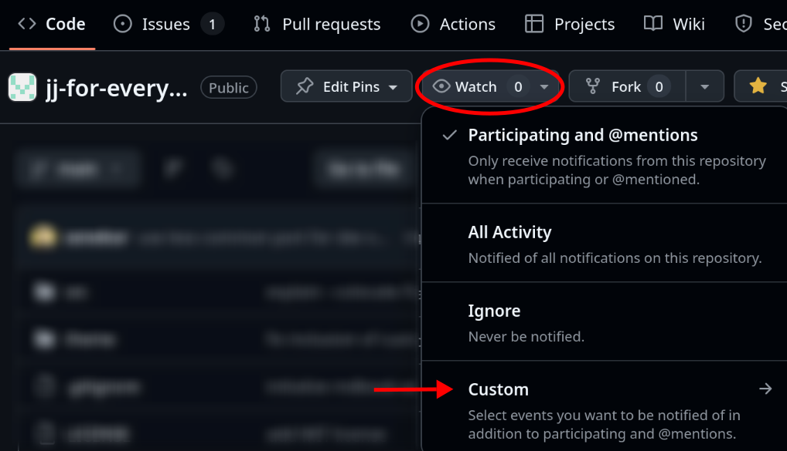

# Stay up to date

Both this tutorial and Jujutsu are still evolving.
In order to keep your Jujutsu knowledge up-to-date, **subscribe to releases of the tutorial's GitHub repo**.
You'll get an email from GitHub whenever I post a release, which basically allows me to send you notifications.

I'm planning to post releases for two reasons in particular:

1. I finished writing a new level.
1. A new version of Jujutsu includes changes that are relevant to readers of this tutorial.

To subscribe: Visit the [GitHub repo](https://github.com/jj-for-everyone/jj-for-everyone.github.io), click on "Watch", then "Custom" and lastly select "Releases".

The following levels are planned for the future:

| Level | Description |
| :-: | --- |
| **4** | History rewriting skills. These will allow you to iterate toward a polished version history, which pays dividends long-term. Some projects require you to have these skills in order to meet their quality standards. |
| **5** | Productivity boosters, advanced workflows, lesser-known CLI functions and a little VCS theory. Completing this level means you have mastered Jujutsu. |
| **6** | Additional topics that only come up in specific situations: tags, submodules, workspaces etc. Consider skimming the list of topics and come back once you have an actual need for it. |

I consider the tutorial up-to-date with Jujutsu **version 0.33**, which was released in **September 2025**.
If that's more than a couple months in the past, I probably stopped updating this tutorial.
